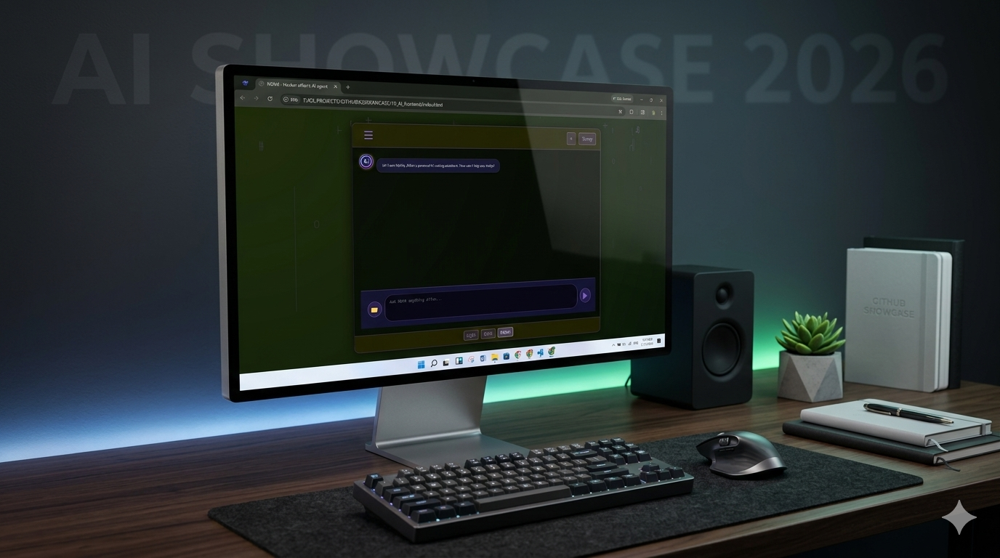
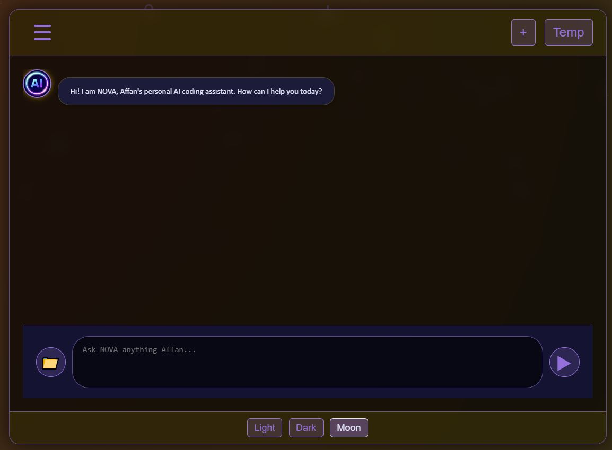

<div align="center">

# 🚀 NOVA - AI Chat Assistant

**A sleek, modern, theme-enabled AI chat interface with a futuristic hacker aesthetic**

[](https://html.spec.whatwg.org/)
[](https://www.w3.org/TR/CSS/)
[](https://developer.mozilla.org/en-US/docs/Web/JavaScript)
[](LICENSE)
[](https://github.com/your-username/nova)
[](https://github.com/your-username/nova)

[Live Demo](#-live-demo) • [Features](#-features) • [Screenshots](#-screenshots) • [Installation](#-installation--setup) • [Contributing](#-contributing)

</div>

---

## 📋 Overview

NOVA is a modern, fully-responsive AI chat assistant frontend built with vanilla HTML, CSS, and JavaScript. Designed with a focus on user experience and aesthetics, NOVA features a dynamic theme system, smooth animations, and a professional interface perfect for integrating with any AI backend API.

Whether you're building a personal coding assistant, customer support chatbot, or interactive AI experience, NOVA provides the sleek, modern UI foundation you need.

---

## ✨ Features

- 🎨 **Multi-Theme Support** – Seamlessly switch between Dark, Light, and Moon themes
- 💾 **Persistent Theme Storage** – Your theme preference is saved locally
- ⚡ **Dynamic Animations** – Smooth gradient backgrounds with hacker-aesthetic effects
- 📱 **Fully Responsive** – Works beautifully on desktop, tablet, and mobile devices
- 💬 **Chat Interface** – Clean message display with AI and user message differentiation
- 🎯 **Modern UI/UX** – Professional styling with carefully chosen typography and spacing
- 🔧 **Easy Integration** – Simple API for connecting to any AI backend
- 🎭 **Visual Effects** – Smooth animations, gradient shifts, and interactive elements
- 📊 **Message History** – Support for saved and temporary chats
- 🚀 **Lightweight** – No dependencies, pure vanilla JavaScript

---

## 📸 Screenshots

### 🌙 Dark Theme (Default)

<p align="center">
  
</p>
<p align="center"><em>Clean, immersive dark interface with golden accents</em></p>

### 🖼️ UI Showcase

<p align="center">
  
</p>
<p align="center"><em>Detailed UI components and design elements</em></p>

### 🔮 Binary Theme

<p align="center">
  
</p>
<p align="center"><em>Alternative theme variant with unique aesthetic</em></p>

---

## 🛠️ Tech Stack

| Category | Technology |
|----------|-----------|
| **Frontend** | HTML5, CSS3, Vanilla JavaScript |
| **Styling** | Custom CSS with CSS Variables |
| **Storage** | LocalStorage API |
| **Fonts** | Calibri, Google Fonts |
| **Deployment** | Static hosting (GitHub Pages, Vercel, Netlify) |

---

## 🚀 Installation & Setup

### Prerequisites

- A modern web browser (Chrome, Firefox, Safari, Edge)
- No build tools or dependencies required!

### Step 1: Clone the Repository

```bash
git clone https://github.com/your-username/nova.git
cd nova
```

### Step 2: Open in Browser

```bash
# Option A: Direct file access
open index.html

# Option B: Using Python (if available)
python -m http.server 8000
# Then navigate to http://localhost:8000

# Option C: Using Node.js (if available)
npx http-server
# Then navigate to http://localhost:8080
```

### Step 3: (Optional) Connect to AI Backend

Update the `script.js` file to connect your AI API endpoint:

```javascript
// Example API integration point in script.js
const sendMessage = async (userMessage) => {
    // Replace with your AI backend API call
    const response = await fetch('YOUR_API_ENDPOINT', {
        method: 'POST',
        headers: { 'Content-Type': 'application/json' },
        body: JSON.stringify({ message: userMessage })
    });
    return response.json();
};
```

---

## 💬 Usage

1. **Type Your Message** – Click in the input area and type your query
2. **Send Message** – Click the send button (▶) or press Enter
3. **Switch Themes** – Use the theme buttons at the bottom (Light/Dark/Moon)
4. **Start New Chat** – Click the "+" button to begin a fresh conversation
5. **Save Chats** – Use "Saved Chats" feature to preserve important conversations

### Keyboard Shortcuts

- **Enter** – Send message
- **Shift+Enter** – New line in message

---

## 📁 Folder Structure

```
nova/
├── index.html           # Main HTML structure
├── style.css            # Global styling and themes
├── script.js            # JavaScript functionality
├── LICENSE              # MIT License
├── README.md            # This file
└── assets/
    └── screenshots/
        ├── home_dark.png
        ├── ui.JPG
        └── binary.JPG
```

---

## 🔮 Future Improvements

- [ ] **Backend Integration** – Connect to OpenAI, Claude, or custom AI APIs
- [ ] **Message Export** – Download chat history as JSON or PDF
- [ ] **Voice Input/Output** – Speech recognition and text-to-speech features
- [ ] **Code Syntax Highlighting** – Better display of code snippets in messages
- [ ] **Image Upload** – Support for image inputs in chat
- [ ] **Advanced Analytics** – Track usage patterns and conversation insights
- [ ] **Dark Mode for Eyes** – Ultra-dark theme for low-light usage
- [ ] **Customizable Avatars** – User and AI avatar personalization
- [ ] **Multi-language Support** – Internationalization (i18n)
- [ ] **PWA Support** – Progressive Web App capabilities for offline access

---

## 🤝 Contributing

We love contributions! Here's how you can help:

1. **Fork** the repository
2. **Create** a feature branch (`git checkout -b feature/amazing-feature`)
3. **Commit** your changes (`git commit -m 'Add amazing feature'`)
4. **Push** to the branch (`git push origin feature/amazing-feature`)
5. **Open** a Pull Request

### Code Style

- Use vanilla JavaScript (no frameworks/transpilers required)
- Keep CSS organized with clear comments
- Test across browsers before submitting PR

---

## 📄 License

This project is licensed under the **MIT License** – see the [LICENSE](LICENSE) file for details.

You're free to use, modify, and distribute this project in your personal and commercial projects.

---

## 👨‍💻 Author

**Created with ❤️ by Affan**

- 🌐 [Portfolio](https://affan675.github.io/01_portfolio_v2/)
- 🐙 [GitHub](https://github.com/affan675)
- 📧 [Email](mailto:your-affanadil119@gmail.com)

---

<div align="center">

### ⭐ If you find NOVA helpful, please consider giving it a star

[⬆ Back to top](#-nova---ai-chat-assistant)

</div>
